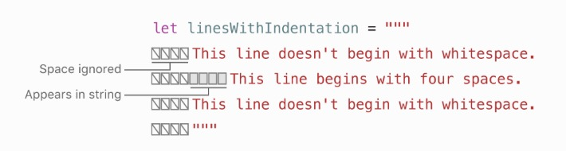
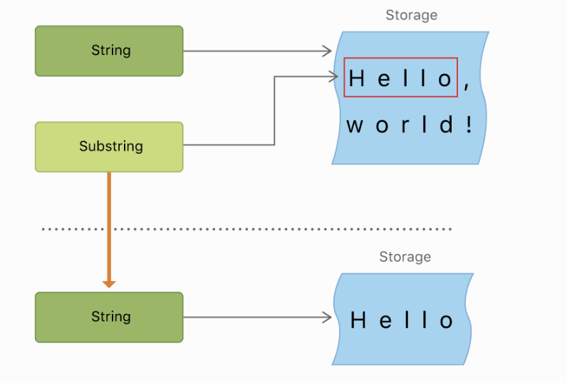
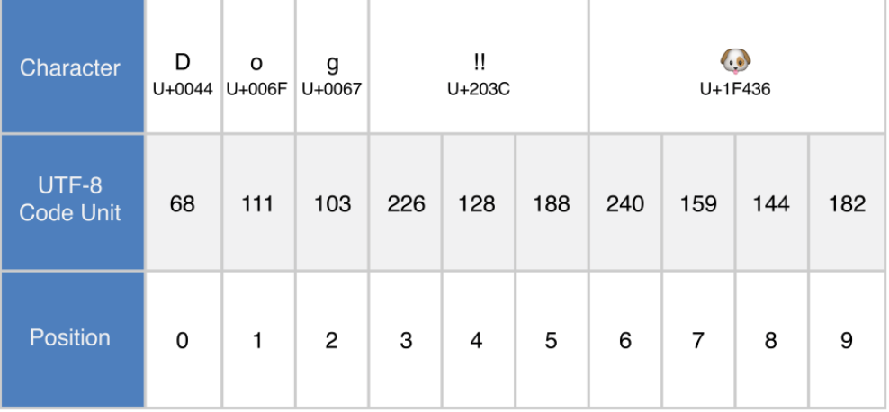
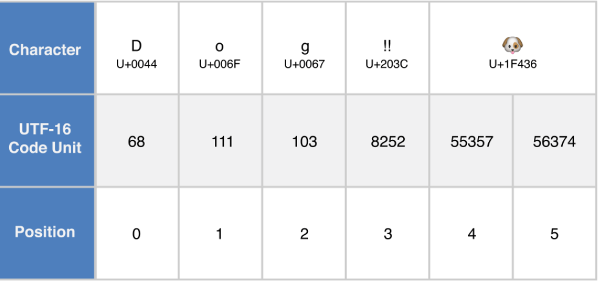
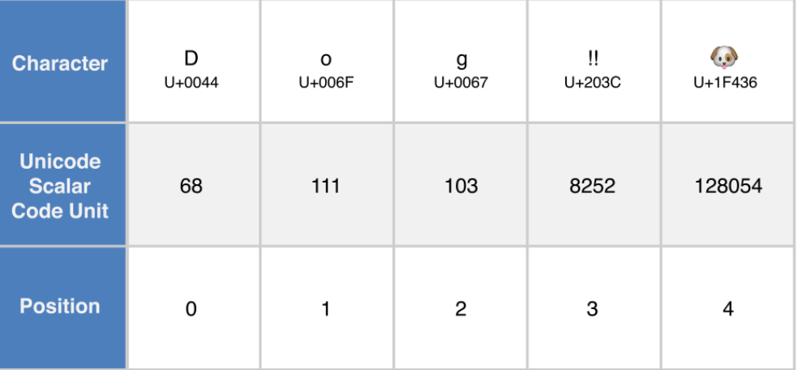

# 三 字符串和字符

字符串是一组字符的合集，例如`"hello, world"`或者`"albatross"` 。Swift中的字符串使用`String`类定义。`String`的内容可以通过多种方式访问，包括作为一组字符返回。

Swift的`String`和`Character`类型提供了一个快速，Unicode兼容的方式来处理代码中的文本。通过使用与C类似的字符串文字型语法，使得字符串的创建和处理更加轻便可读。字符串结合可以简单地通过使用`+`运算符连接两个字符串，字符串是否可变与Swift其他类型值一样仅取决于声明为常量（不可变）或变量（可变）。可以通过字符串插值操作很容易的将常量、变量、文本、表达式插入到一个长字符串中。这个使得创建用来显示、存储、打印的特定格式的字符串更容易。

Swift的`String`类尽管语法非常简单，但是它是一种快速、先进的文字处理的实现。每个字符串都由与编码无关的Unicode字符组成，并提供对各种Unicode表示形式访问这些字符的支持。

> 注意
>
> > Swift的`String`类是通过Foundation的`NSString`类桥接过来的。Foundation框架也通过扩展`String`暴露了`NSString`的方法。也就是如果引用Foundation框架，那么无需转换`String`为`NSString`就可以访问`NSString`方法。 更多关于`String`在Foundation和Cocoa中的使用，请参考《Using Swift with Cocoa and Objective-C \(Swift 4\)》中的Cocoa数据类型的使用

## 字符串字面量

可以在代码中预定义`String`值，作为字符串字面量。字符串字面量是被双引号包裹的一组字符。

可以使用字符串字面量作为常量或变量的初始值：

```swift
let someString = "Some string literal value”
```

注意由于`someString`通过字符串字面量初始化，所以被自动定义为`String`类型

### 多行字符串字面量

如果需要将一个字符串分隔成多行，可以使用多行字符串字面量定义——通过三个双引号中的一组字符序列来定义：

```swift
let quotation = """
The White Rabbit put on his spectacles.  "Where shall I begin,
please your Majesty?" he asked.

"Begin at the beginning," the King said gravely, "and go on
till you come to the end; then stop."
"""
```

多行字符串字面量包含三个双引号中间的所有行。字符串从起始双引号之后开始从结束双引号之前结束。也就是下面两种字符串写法中都不包含换行符：

```swift
let singleLineString = "These are the same."
let multilineString = """
These are the same.
"""
```

如果多行字符串字面量中包含换行符，那么换行符也会显示在字符串值中。如果只是想通过换行符使得代码可读性更强，但并不需要在字符串中显示出来，那么在不需要显示换行符的行末添加反斜杠`(\)`。

```swift
let softWrappedQuotation = """
The White Rabbit put on his spectacles.  "Where shall I begin, \
please your Majesty?" he asked.

"Begin at the beginning," the King said gravely, "and go on \
till you come to the end; then stop."
"""
```

如果想使得多行字符串字面量前后有空行，可以通过在字符串前后添加空行的方式实现。例如：

```swift
let lineBreaks = """

This string starts with a line break.
It also ends with a line break.

"""
```

多行字符串会自动为其中的代码进行缩进。Swift会自动忽略结束双引号之前的包括其他行的空格。如果在自动缩进的基础上手动添加空格，那么这些空格就会包含在其中。



在上面的例子中，虽然整个多行字符串是有缩进的，第一行和最后一行字符串也不会包含任何空格。因为第二行要比其他行缩进的多，所以会包含四个空格的缩进。

### 多行字符串字面量中的特殊字符

多行字符串字面量可以包含以下特殊字符：

* 转义特殊字符`\0`（空字符）， `\\`（反斜杠）, `\t`（z制表符），`\n`（换行符），`\r`（），`\"`（双引号），`\'`（单引号）
* 任意`Unicode`编码值，以`\u{n}`的格式书写，`n`是1-8位十六进制数组成的一个有意义的Unicode编码打印值（Unicode会在之后的[Unicode](san-zi-fu-chuan-he-zi-fu.md#unicode)中介绍）

下面的例子展示了四种特殊字符的例子。`wiseWords`常量包含了两个转义双引号。`dollarSin`，`blackHeart`，和`sparklingHeart`常量展示了Unicode的格式：

```swift
let wiseWords = "\"Imagination is more important than knowledge\" - Einstein"
// "Imagination is more important than knowledge" - Einstein
let dollarSign = "\u{24}"        // $,  Unicode scalar U+0024
let blackHeart = "\u{2665}"      // ♥,  Unicode scalar U+2665
let sparklingHeart = "\u{1F496}" // 💖, Unicode scalar U+1F496
```

由于多行字符串字面量的定义是用三对双引号，所以可以在多行字符串字面两种直接加入非转义的单个双引号。如果要包含`"""`的话，至少要有一个双引号要进行转义。例如：

```swift
let threeDoubleQuotationMarks = """
Escaping the first quotation mark \"""
Escaping all three quotation marks \"\"\"
"""
```

## 初始化空字符串

可以通过给字符串变量赋值为空字符串或者使用`String`的初始化方法创建一个空字符串，以作为拼接一个长字符串的起点：

```swift
var emptyString = ""               // empty string literal
var anotherEmptyString = String()  // initializer syntax
// these two strings are both empty, and are equivalent to each other
```

可以通过检查`isEmpty`属性来判断`String`value是否为空字符串：

```swift
if emptyString.isEmpty {
    print("Nothing to see here")
}
// Prints "Nothing to see here”
```

## 字符串可变性

可以通过表明字符串为常量（不可变）或变量（可变）来指定字符串是否可变：

```swift
var variableString = "Horse"
variableString += " and carriage"
// variableString is now "Horse and carriage"

let constantString = "Highlander"
constantString += " and another Highlander"
// this reports a compile-time error - a constant string cannot be modified
```

> 注意
>
> > Swift的字符串的可变性与`Objective-C`和`Cocoa`中的定义（通过两个类`NSString`、`NSMutableString`来定义字符串是否可变）是不同的

## 字符串是值类型

Swift中的`String`是值类型。如果创建一个`String`类型的值，在作为参数传入函数或方法中或者给常量或变量赋值的时候实际上传递的是字符串的一个拷贝。在上边的情况中，都是从该值创建了一个新的拷贝，实际上传递的是这个拷贝，并不是该值。关于值类型请参考[结构体和枚举是值类型](jiu-lei-he-jie-gou-ti.md#structuresandEnumerationsAreValueTypes)

Swift中`String`默认拷贝的特性，保证当字符串或者方法传给你一个`String`的值得时候，不管它从哪来你获取到的都是一个确确实实的`String`类型值。你可以确定你得到的字符串除了你自己谁都不能去修改。

在底层，Swift的编译器优化了字符串的使用，以便只有在必要时才进行实际的复制。 这意味着在字符串作为值类型时使用总能得到最好的结果。

## 字符的使用

可以使用`for-in`表达式来通过遍历的方式获取`String`中的单个`Character`值：

```swift
for character in "Dog!🐶" {
    print(character)
}
// D
// o
// g
// !
// 🐶
```

`for-in`循环请参见[For-in循环](wu-liu-cheng-kong-zhi.md#for-inLoops)

或者也可以使用`Character`类型创建一个字符常量或变量并为其赋值：

```swift
let exclamationMark: Character = "!"
```

`String`值可以通过在其构造函数中传入一个`Character`数组的方式进行初始化：

```swift
et catCharacters: [Character] = ["C", "a", "t", "!", "🐱"]
let catString = String(catCharacters)
print(catString)
// Prints "Cat!🐱”
```

### 字符和字符串的串联

多个字符串值可以通过加法运算符`+`组合成一个新的字符串：

```swift
let string1 = "hello"
let string2 = " there"
var welcome = string1 + string2
// welcome now equals "hello there”
```

也可以通过加法赋值运算符`+=`将一个字符串添加到另一个字符串之后：

```swift
var instruction = "look over"
instruction += string2
// instruction now equals "look over there”
```

通过`String`类型的`append()`方法可以将字符类型的数据添加到字符串中：

```swift
let exclamationMark: Character = "!"
welcome.append(exclamationMark)
// welcome now equals "hello there!”
```

> 注意
>
> > 由于`Character`只能包含一个字符，所以不能向字符变量中添加字符串

如果需要通过多行字符串字面量创建一个更长的字符串，并且每行之后都包含一个换行符，如下：

```swift
let badStart = """
one
two
"""
let end = """
three
"""
print(badStart + end)
// Prints two lines:
// one
// twothree

let goodStart = """
one
two

"""
print(goodStart + end)
// Prints three lines:
// one
// two
// three
```

上例中，通过`badStart`和`end`结合生成了一个两行的字符串，这并不是我们想要的。因为在`badStart`的最后一行并没有换行符，所以这一行就会直接拼接上`end`的第一行。不同的是，`goodStart`的每一行末尾都包含换行符，所以当与`end`相加时就会返回预期的三行。

## 字符串插值

字符串插值是在字符串字面量中通过插入常量、变量、字面量、或者表达式从而组成一个新的字符串的方法。字符串插值可以用在单行和多行字符串字面量中。每一个插入字符串字面量的元素都要写在前面带反斜杠的双括号中：

```swift
let multiplier = 3
let message = "\(multiplier) times 2.5 is \(Double(multiplier) * 2.5)"
// message is "3 times 2.5 is 7.5”
```

上例中，通过`\(multiplier)`将`multiplier`的值插入到字符串字面量中。当字符串插值执行以创建一个字符串的时候，占位符会被`multiplier`的实际值替换掉。

同时`multiplier`也是字符串后边插入的一个表达式的一部分。表达式会计算出`Double(multiplier) * 2.5`的结果`7.5`并将其插入到字符串中。这个例子中，表达式在插入到字符串字面量中时应以`\(Double(multiplier) * 2.5)`的形式书写。

> 注意
>
> > 插入字符串中的表达式不能有非预期的反斜杠、换行符、回车符。可以包含其他字符串字面量

## Unicode

Unicode 是用来在不同系统之间表达、传递文本信息的国际标准编码。它几乎可以以标准化形式展示所有语言中的所有字符，也可以用来对外部文件（例如文本文件）的读取或写入字符。Swift中的`String`和`Charactor`类型是完全Unicode编码的，本章节中我们将详细说明。

### Unicode标量

Swift原生`String`类型是有Unicode标量创建。字符或修饰符的Unicode标量是一个唯一的21位数字，例如`U+0061`为小写拉定字母A\(`a`\)，`U+1F425`是一个正面的小鸡的字符\(`🐥`\)。

> 注意
>
> > Unicode标量是从U+0000到U+D7FF（含）或U+E000到U+10FFFF（含）的任何Unicode代码点。 Unicode标量不包括Unicode代理对代码点，这些代码点是U+D800到U+DFFF范围内的代码点。

并不是所有的21位Unicode标量都有其表示的字符——一些标量是为了以后扩展使用的。已经有具体字符的标量也有自己的名称，例如上例中的拉丁小写字母A`LATIN SMALL LETTER A`，正面的小鸡`FRONT-FACING BABY CHICK`。

### 拓展字形集群

每一个`Character`类型的实例都代表一个拓展字形集群。一个拓展字形集群是组由一个或多个Unicode标量组成的一个可读的字符。

例如，`é`代表一个单独的Unicode标量`é`\(小写尖音E`LATIN SMALL LETTER E WITH ACUTE`或者`U+00E9`\)。然而，同样的字母可以用一组标量来展示——一个标准字母`e`（小写拉定字母E`LATIN SMALL LETTER E`或`U+0065`）后跟一个组合用尖音符号`COMBINING ACUTE ACCENT`标量（`U+0301`）。 组合用尖音符号`COMBINING ACUTE ACCENT`会自动加在字母标量之上，当着一组标量被Unicode环境下的文本翻译系统读取时会将`e`变为`é`。

在第一中情况中，该群集值包含一个标量；在第二中情况是一个两个标量的群集。在两种情况下，`é`作为拓展字形集群会以单个字符显示：

```swift
let eAcute: Character = "\u{E9}"                         // é
let combinedEAcute: Character = "\u{65}\u{301}"          // e followed by ́
// eAcute is é, combinedEAcute is é
```

拓展字形集群可以以灵活的方式将多个无意义的字符组合为一个字符。例如，例如，韩文字母中的韩文音节可以表示为预先分解或分解的序列。这两个表示都符合Swift中的单个字符值：

```swift
let precomposed: Character = "\u{D55C}"                  // 한
let decomposed: Character = "\u{1112}\u{1161}\u{11AB}"   // ᄒ, ᅡ, ᆫ
// precomposed is 한, decomposed is 한
```

扩展的字形群集使标量符号（例如组合用闭合圆`COMBINING ENCLOSING CIRCLE`，或`U+20DD`）能够将其他Unicode标量作为一个Character值的一部分包含进来：

```swift
let enclosedEAcute: Character = "\u{E9}\u{20DD}"
// enclosedEAcute is é⃝
```

国旗符号的Unicode标量可以成对组合成一个字符值，例如区域指示符号字母U`REGIONAL INDICATOR SYMBOL LETTER U`（`U+1F1FA`）和区域指示符号字母S`REGIONAL INDICATOR SYMBOL LETTER S`（`U+1F1F8`）的这个组合：

```swift
let regionalIndicatorForUS: Character = "\u{1F1FA}\u{1F1F8}"
// regionalIndicatorForUS is 🇺🇸
```

## 字符计算

使用`count`属性可以或者字符串中字符的个数：

```swift
let unusualMenagerie = "Koala 🐨, Snail 🐌, Penguin 🐧, Dromedary 🐪"
print("unusualMenagerie has \(unusualMenagerie.count) characters")
// Prints "unusualMenagerie has 40 characters”
```

注意在拓展字形集群时，当修改或串联字符串并不一定会影响字符串长度。

例如，如果初始化一个四个字符字符串`cafe`，然后在字符串后添加一个组合用尖音`COMBINING ACUTE ACCENT` \(`U+0301`\)，得到的字符串长度任然是`4`个字符，第四个字符为`é`而不是`e`：

```swift
var word = "cafe"
print("the number of characters in \(word) is \(word.count)")
// Prints "the number of characters in cafe is 4"

word += "\u{301}"    // COMBINING ACUTE ACCENT, U+0301

print("the number of characters in \(word) is \(word.count)")
// Prints "the number of characters in café is 4”
```

> 注意
>
> > 拓展字形集群可能由多个Unicode标量组成。也就是说不同的字符，不同表达方式的同一字符，可能需要不同大小的内存来存储。如此一来，在字符串中，每个字符所占的内存并不一定相同。因此，如果不迭代字符串以确定其扩展的字形群集边界，则无法计算字符串中的字符数。如果您使用特别长的字符串值，请注意`count`属性必须遍历整个字符串中的Unicode标量以确定该字符串的字符。`count`属性返回的字符数并不总是与包含相同字符的`NSString`的`length`属性相同。 `NSString`的长度是基于字符串的UTF-16表示中的16位代码单元的数量，而不是字符串中的Unicode扩展字形群集的数量。

## 访问和修改字符串

可以通过字符串的方法，属性或者下标语法访问和修改字符串。

### 字符串索引

每个字符串值都有一个与其关联的索引类型`String.Index`，用来得到字符在字符串中的位置。

就像上面提到的，不同的字符需要不同大小的内存来存储，所以要查明某个字符在字符串中的位置，必须要从开始或结尾遍历字符串的每一个Unicode标量。所以，Swift不能通过整型值进行索引。

使用`startIndex`属性访问字符串的第一个字符，使用`endIndex`属性是字符串中最后一个字符之后的位置。所以，`endIndex`属性并不是一个有效的字符串下标。如果字符串为空，那么```startIndex``endIndex```相等。

使用`index(before:)`和`index(after:)`方法可以获取已知索引之前或之后的位置。获取跟已知索引偏移量较大的索引时为了不去频繁调用上面两种方法可以通过`index(_:offsetBy:)`来获取。

可以通过下标访问字符串中特定位置的字符：

```swift
let greeting = "Guten Tag!"
greeting[greeting.startIndex]
// G
greeting[greeting.index(before: greeting.endIndex)]
// !
greeting[greeting.index(after: greeting.startIndex)]
// u
let index = greeting.index(greeting.startIndex, offsetBy: 7)
greeting[index]
// a
```

尝试访问字符串范围之外的索引或者字符串索引之外的字符时会触发运行时错误：

```swift
greeting[greeting.endIndex] // Error
greeting.index(after: greeting.endIndex) // Error”
```

使用`indices`属性可以访问字符串所有索引下的单独的字符：

```swift
for index in greeting.indices {
    print("\(greeting[index]) ", terminator: "")
}
// Prints "G u t e n   T a g ! ”
```

> 注意
>
> > 任何实现`Collection`协议的类型都可以使用`startIndex`、`endIndex`属性和`index(before:)`、`index(after:)`、`index(_:offsetBy:)`。这些类型包括本章介绍的`String`，以及集合类`Array`、`Dictionary`和`Set`。

### 插入和移除

使用`insert(_:at:)`方法可以将字符插入到字符串特定的位置，使用`insert(contentsOf:at:)`可以将另一字符串插入到字符串的特定位置。

```swift
var welcome = "hello"
welcome.insert("!", at: welcome.endIndex)
// welcome now equals "hello!"

welcome.insert(contentsOf: " there", at: welcome.index(before: welcome.endIndex))
// welcome now equals "hello there!”
```

使用`remove(at:)`方法可以将特定索引下的字符从字符串中删除；使用`removeSubrange(_:)`可以将特定范围中的字符从字符串中删除：

```swift
welcome.remove(at: welcome.index(before: welcome.endIndex))
// welcome now equals "hello there"

let range = welcome.index(welcome.endIndex, offsetBy: -6)..<welcome.endIndex
welcome.removeSubrange(range)
// welcome now equals "hello”
```

> 注意
>
> > 任何实现`RangeReplaceableCollection`协议的类型都可以使用`insert(_:at:)`、`insert(contentsOf:at:)`、`remove(at:)`、`removeSubrange(_:)`方法。包括本章所介绍的`String`，以及集合类型中的`Array`，`Dictionary`，`Set`。

## 子字符串（Substrings）

当使用下标或者`prefix(_:)`方法获取一个字符串的子字符串时，得到的结果是一个`Substring`的实例，而不是另一个字符串。在Swift中子字符串几乎拥有所有字符串的方法，也就是你可以在使用时将子字符串作为字符串来看待。但是，与字符串不同的是，子字符串所存在的时间要小于其所在字符串存在的时间。所以当你想使得子字符串的生命周期更长时，需要将子字符串转换为字符串实例，例如：

```swift
let greeting = "Hello, world!"
let index = greeting.index(of: ",") ?? greeting.endIndex
let beginning = greeting[..<index]
// beginning is "Hello"

// Convert the result to a String for long-term storage.
let newString = String(beginning)
```

像字符串一样，子字符串指向了一段由字符组成的子字符串所在的内存空间。但与字符串不同的是，为了优化性能，子字符串可以复用其所在字符串的内存空间，或者是一段用来存储其他子字符串的内存空间。（字符串也做了同样的优化，但是如果两个字符串共享没存的话，它们就是相等的）这种方式的优化使得你在修改字符串或子字符串之前无需耗费性能去对字符串进行拷贝。像上面介绍的，子字符串并不适合用来做长时间存储——因为它们只想的内存空间是其所在字符串中的一部分，子字符串必须的使用时机必须是在字符串被内存释放之前。

在上例中，`greeting`是一个字符串，并持有一段组成该字符串字符所占的内存。由于`beginning`是`greeting`的子字符串，所以它指向的内存空间是`greeting`的一段，`newString`是一个字符串——当由子字符串进行实例化时，它就持有了一段自己的内存空间。下图展示了它们间的关系：



> 注意
>
> > `String`和`Substring`都实现了`StringProtocol`协议，这就意味着字符串操作函数接受一个`StringProtocol`的值是很方便的。可以使用`String`或`Substring`调用这些方法

## 字符串比较

Swift提供了三种比较文字值的方式：字符串和字符判等，前缀判等，后缀判等。

### 字符和字符串比较

使用等于运算符（`==`）和不等运算符（`!=`）判断字符串和字符是否相等，在[比较运算符](er-ji-chu-yun-suan-fu.md#comparisonOperators)中有详细说明：

```swift
let quotation = "We're a lot alike, you and I."
let sameQuotation = "We're a lot alike, you and I."
if quotation == sameQuotation {
    print("These two strings are considered equal")
}
// Prints "These two strings are considered equal”
```

如果两个字符或字符串的拓展字形集群是正则相等的，那么这两个字符或字符串就是相等的。如果两个拓展字形集群有相同的意义及展现，就算不是使用同一种形式的Unicode标量组成的，那么这两个拓展字形集群也是正则相等的。

例如，尖音小写拉定字符e`LATIN SMALL LETTER E WITH ACUTE`\(`U+00E9`\)与小写

例如，尖音小写拉丁字符e`LATIN SMALL LETTER E WITH ACUTE`\(`U+00E9`\)与小写拉丁字符e`LATIN SMALL LETTER E`\(`U+0065`\)后跟一个尖音字符`COMBINING ACUTE ACCENT`（`U+0301`）是相等的。这两种拓展字形集群都会以正确的方式显示`é`字符，所以它们被认为是正则相等：

```swift
// "Voulez-vous un café?" using LATIN SMALL LETTER E WITH ACUTE
let eAcuteQuestion = "Voulez-vous un caf\u{E9}?"

// "Voulez-vous un café?" using LATIN SMALL LETTER E and COMBINING ACUTE ACCENT
let combinedEAcuteQuestion = "Voulez-vous un caf\u{65}\u{301}?"

if eAcuteQuestion == combinedEAcuteQuestion {
    print("These two strings are considered equal")
}
// Prints "These two strings are considered equal"
```

相反的，英语中的大写拉丁字符A`LATIN CAPITAL LETTER A`（`U+0041`，或者`A`），与俄语中的大写西里尔字符A`CYRILLIC CAPITAL LETTER A`（`U+0410`，或者`A`）并不相等。两个字符虽然看起来一样，但是语义并不相同：

```swift
let latinCapitalLetterA: Character = "\u{41}"

let cyrillicCapitalLetterA: Character = "\u{0410}"

if latinCapitalLetterA != cyrillicCapitalLetterA {
    print("These two characters are not equivalent.")
}
// Prints "These two characters are not equivalent.”
```

> 注意
>
> > Swift中的字符串和字符比较不是区域敏感的。

### 前缀和后缀的比较

通过`hasPrefix(_:)`，`hasSuffix(_:)`检查字符串是否包含特定的字符串前后缀，两个方法参数都为一个字符串并返回布尔值。

下面的例子展示了一组代表莎士比亚罗密欧与朱丽叶前两幕的场景位置的字符串：

```swift
let romeoAndJuliet = [
    "Act 1 Scene 1: Verona, A public place",
    "Act 1 Scene 2: Capulet's mansion",
    "Act 1 Scene 3: A room in Capulet's mansion",
    "Act 1 Scene 4: A street outside Capulet's mansion",
    "Act 1 Scene 5: The Great Hall in Capulet's mansion",
    "Act 2 Scene 1: Outside Capulet's mansion",
    "Act 2 Scene 2: Capulet's orchard",
    "Act 2 Scene 3: Outside Friar Lawrence's cell",
    "Act 2 Scene 4: A street in Verona",
    "Act 2 Scene 5: Capulet's mansion",
    "Act 2 Scene 6: Friar Lawrence's cell"
]
```

可以使用`hasPrefix(_:)`计算罗密欧与朱丽叶剧本字符串数组中Act 1的条数：

```swift
var act1SceneCount = 0
for scene in romeoAndJuliet {
    if scene.hasPrefix("Act 1 ") {
        act1SceneCount += 1
    }
}
print("There are \(act1SceneCount) scenes in Act 1")
// Prints "There are 5 scenes in Act 1”
```

同样，使用`hasSuffix（_ :)`方法来计算在Capulet大厦和Friar Lawrence小区或周围发生的场景数量：

```swift
var mansionCount = 0
var cellCount = 0
for scene in romeoAndJuliet {
    if scene.hasSuffix("Capulet's mansion") {
        mansionCount += 1
    } else if scene.hasSuffix("Friar Lawrence's cell") {
        cellCount += 1
    }
}
print("\(mansionCount) mansion scenes; \(cellCount) cell scenes")
// Prints "6 mansion scenes; 2 cell scenes"
```

> 注意
>
> > `hasPrefix(_:)`和`hasSuffix(_:)`方法会通过正则判等逐字符的对扩展字符群集进行判断，如在[字符和字符串比较](san-zi-fu-chuan-he-zi-fu.md#stringAndCharacterEquality)中所表述的。

## 字符串的Unicode表示

当一个Unicode字符串写入到文本文件或其他存储器中时，该字符串中的Unicode标量被编码为几种Unicode定义的编码形式之一。每种格式都会将字符串编码为小块编码也就是代码单元。包括`UTF-8`编码格式（将字符串编码为8位的代码单元），`UTF-16`编码格式（将字符串编码为16位的代码单元），`UTF-32`编码格式（将字符串编码为32位的代码单元）.

Swift提供了几种不同的方式来访问字符串的Unicode表示。可以使用`for-in`来获取字符串中每个Unicode拓展字符集。这部分在[字符的使用](san-zi-fu-chuan-he-zi-fu.md#workingWithCharacters)中有所讲解。

或者，在其他三个符合Unicode表现之一的形式中访问字符串：

* 一组`UTF-8`代码单元（使用字符串`utf8`属性访问）
* 一组`UTF-16`代码单元（使用字符串`utf16`属性访问）
* 一组`UTF-32`代码单元（使用字符串`utf32`属性访问）

下面的每个例子都展示了一种下面字符串不同的表现形式，有字符`D`,`o`,`g`,`!!`（双感叹号`DOUBLE EXCLAMATION MARK`，或Unicode标量`U+203C`），以及`🐶`字符（狗头`DOG FACE`，或Unicode标量`U+1F436`）:

```swift
let dogString = "Dog‼🐶"
```

### UTF-8表示

可以通过遍历字符串的`utf8`属性来访问字符串的`UTF-8`表示。这个属性的类型为`String.UTF8View`，是一组无符号8位的值，每一个都代表了`UTF-8`表示中的一个字节：



```swift
for codeUnit in dogString.utf8 {
    print("\(codeUnit) ", terminator: "")
}
print("")
// Prints "68 111 103 226 128 188 240 159 144 182 "
```

在上面的例子中，前三个十进制的代码单元`codeUnit`的值（`68`,`111`,`103`）代表了字符`D`,`o`,`g`，它们的`UTF-8`表示与`ASCII`表示是一样的。接下来的三个十进制代码单元`codeUnit`的值（`226`,`128`,`188`）分别为双感叹号`DOUBLE EXCLAMATION MARK`UTF-8表示的三个字节。最后的四个十进制代码单元`codeUnit`的值（`240`,`159`,`144`,`182`）分别为狗头`DOG FACE`UTF-8表示的四个字节

### UTF-16表示

可以通过遍历字符串的`utf16`属性来访问字符串的`UTF-16`表示。这个属性的类型为`String.UTF16View`，是一组无符号16位的值，每一个都代表了`UTF-16`表示中的一个字节：



```swift
for codeUnit in dogString.utf16 {
    print("\(codeUnit) ", terminator: "")
}
print("")
// Prints "68 111 103 8252 55357 56374"
```

同样的，前三个十进制的代码单元`codeUnit`的值（`68`,`111`,`103`）代表了字符`D`,`o`,`g`，它们的`UTF-8`表示与`ASCII`表示是一样的。

第四个代码单元`codeUnit`值（`8252`）是十进制并且与16进制（`203C`）相等的值，为Unicode标量`U+203C`也就是双感叹号`DOUBLE EXCLAMATION MARK`的表示。这个字符可以在`UTF-16`编码格式中以一个单独的代码单元表示。

第五第六个代码单元（`codeUnit`）值为（`55357`和`56374`）是`UTF-16`中的`DOG FACE`的表现形式。这些值是低代理值U+D83D（十进制值55357）和高代理值U+DC36（十进制值56374）。

### Unicode标量表示

可以通过遍历字符串的`unicodeScalars`属性来访问字符串的Unicode标量表示。这个属性的类型为`UnicodeScalarView`，是一组`UnicodeScalar`类型的值。 每一个`UnicodeScalar`都有一个21位的`value`属性，以一个`UInt32`的值表示：



```swift
for scalar in dogString.unicodeScalars {
    print("\(scalar.value) ", terminator: "")
}
print("")
// Prints "68 111 103 8252 128054"
```

前三个`UnicodeScalar`的`value`属性的值为（`68`,`111`,`103`）仍然代表了字符`D`,`o`,`g`。

第四个`codeUnit`值为（`8252`）作为十进制与十六进制的`203C`相等，表示Unicode标量`U+203C`也就是双感叹号`DOUBLE EXCLAMATION MARK`字符。

第五个`UnicodeScalar`的`value`属性值为`128054`，作为十进制与十六进制的`1F436`相等，表示Unicode标量`U+1F436`，也就是狗头`DOG FACE`字符。

除了使用`value`属性，`UnicodeScalar`也可以用来创建新的字符串，例如使用字符串差值的方式：

```swift
for scalar in dogString.unicodeScalars {
    print("\(scalar) ")
}
// D
// o
// g
// ‼
// 🐶
```

